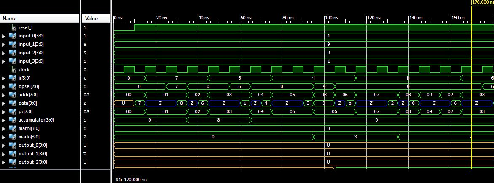

Lab5
====

####Functionality
Required and A functionality completed, no "cool" program written though

###Discussion of 1st Program Operation
The program essentially loaded 8 into the accumulator and increased it until it reached 0. Each value was outputted to port 3 and the program ended in an infinite loop if the number is not zero.

###Discussion of 1st Program Instruction Cycles	

35-45: Fetch  
45-55: Decode 
55-65: Immediate Execute  
65-75: Fetch  
75-85: Decode 
85-95: Decode LoAddr  
95-105: Direct IO Execute 
105-115: Fetch  
115-125: Decode 
125-135: Decode LoAddr  
135-145: Decode HiAddr  
145-155: Jump Exe 
155-165: Fetch  

###Answers to PRISM Questions
1. PCLd = 1   IRLd = 1   ACCLd = 0

2.MARLoLd, PCLd, Read, MemSel_l and AEQZero. Next state is Direct IO Execute

3.IR, ALessZero, AEQZero

4.It tells the controller what the value added to the operand will be

5.IR and OpSel would have to be modified to be able to perform this instruction.

###2nd Program Demo on FPGA

